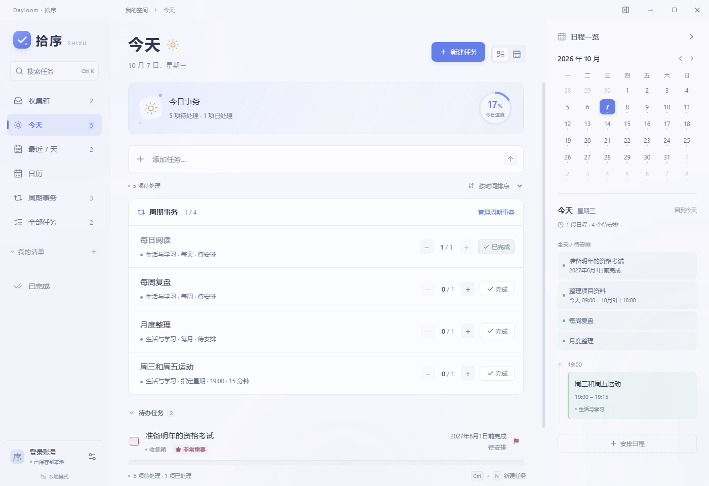
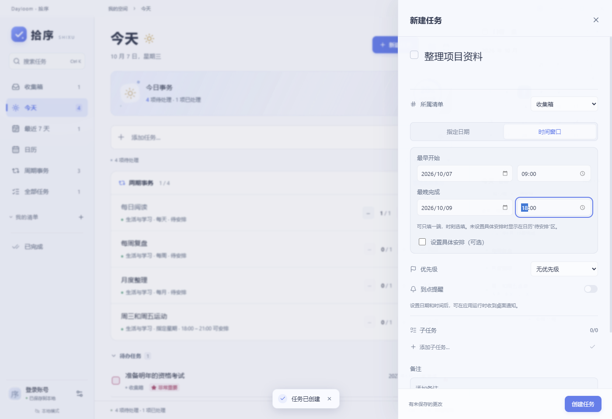

# Dayloom · 拾序

一个可以离线使用的 Windows 桌面任务与日程应用。参考滴答清单的导航结构，采用原生亚克力窗口、半透明面板与克制的蓝色。主文字 14–15px，支持浅色、深色和跟随系统。

## 直接使用

双击 `release/Dayloom-1.3.0-Windows.exe`（或 `启动拾序.cmd`），桌面程序无需安装 Node.js，本机模式无需登录。

桌面快捷方式名为 **Dayloom**，直接打开 `release/win-unpacked/拾序.exe`。移动项目目录后，可运行 `powershell -File scripts/create-desktop-shortcut.ps1` 更新桌面与开始菜单快捷方式。正式版启动时也会更新自己的开始菜单入口，开发版使用独立的 Windows 应用标识，避免关联到失效的开发路径。任务栏使用独立的 ICO 文件；便携版使用外层 EXE 的图标和启动路径，避免记录临时解压目录。

也可以打开 `release/win-unpacked/拾序.exe`。首次运行包含可编辑的示例任务；在「设置 → 清除示例」中移除尚未修改的示例。

推荐 Windows 11 22H2 或更新版本，能显示系统亚克力背景。其他 Windows 版本使用柔和背景回退。应用未做代码签名。

## 已实现

- 任务创建、编辑、完成、恢复、删除与撤销删除。
- 收集箱、今天（含逾期）、最近 7 天、全部任务、已完成、自定义清单。
- 清单新建、编辑、换色、删除；删除清单时任务移回收集箱。
- 五档优先级（含「非常重要」）、计划日期、开始时间、时长、备注与子任务。
- 全局搜索名称、备注、子任务与清单；按日期或优先级排序。
- 迷你月历与当天日程；完整周/月日历。
- 点击时间格创建日程，拖动日程改期；重叠事件并排，跨午夜日程在次日接续。
- 应用运行期间的桌面提醒；仅提醒显式打开开关且设置日期和时间的任务。
- 本地持久化、原子写入、自动保留上一份备份、损坏文件恢复。
- JSON 导入与导出；导入校验后确认替换。
- 深浅主题、磨砂浓度、原生窗口拖动/最小化/最大化/关闭。
- 周期事务：普通事务与游戏分组管理，每天、指定星期、每周、每月重复；每期独立记录次数。
- 非常重要：未完成任务每天显示在「今天」，不受远期计划日期或最早时间限制；勾选完成整个任务。
- 时间窗口：最早开始、最晚完成均可选，仅填截止日期也可；无需事先填写起始时刻和时长。
- 按游戏自定义服务器时区、凌晨刷新时间、周/月刷新日；自动切换新周期。
- 今日待办、一周规划、规则管理；暂停恢复、逐次打卡、预计时长与剩余体力。
- 普通周期事务出现在「今天」；所有周期事务同步到日历；每期可单独改期，完成记录独立保存。
- 自部署账号服务：注册、登录、修改密码；同一账号跨设备同步任务、清单、周期规则、完成记录与外观。
- 离线编辑与自动重试、账号缓存隔离、并发修改合并、冲突副本与请求去重。

桌面提醒需要应用保持运行，最小化也可以；退出后不提醒。当前版本不包含第三方日历订阅。重复规则在「周期事务」中配置。周期事务和未指定具体安排的时间窗口暂不发送桌面通知。

## 周期事务

1. 打开左侧「周期事务」，点击「新建事务」，添加普通或游戏分组。
2. 普通分组默认本机时间、00:00、周一、每月 1 日刷新；游戏分组默认 UTC+8、04:00，可按实际规则修改。
3. 选择每天、指定星期、每周或每月，再选「不限时间」「时间窗口」或「固定时间」。不限时间和窗口模式不要求填写起始时刻与时长；周/月规则可选计划日。
4. 在「今天」处理普通事务，或到「周期事务 → 今日待办」处理全部分组。每次打卡独立保存，新周期自动归零。
5. 点击日历或一周规划中的事务，可以单独调整本期，不能拖出本周期或时间窗口。未来周期可安排，尚未开始时不能提前打卡。

普通分组可跟随本机时区与夏令时。游戏的固定服务器时区不跟随夏令时，刷新前仍属于前一游戏日；29–31 日在短月份使用月末。暂停保留进度；删除分组会一并删除其事务与完成记录。修改重复规则开始新计数，修改名称、目标和时间窗口保留计数。游戏示例为虚构活动。

## 非常重要

在任务详情或快捷添加的优先级里选择「非常重要」。即使截止日期在几个月后、最早时间尚未到达，未完成任务也每天显示在「今天」并靠前排列。

- 勾选框完成整个任务；完成当天仍可查看，之后不再每天展示，可在「已完成」恢复。
- 调低优先级后，恢复普通任务的日期筛选。日历仍显示实际安排，不生成每日副本。
- 旧版「重要不紧急」自动迁移为非常重要，原推进历史随数据备份保留。独立栏目和每日推进开关已移除。

## 账号与跨设备同步

在一台设备上运行 `npm run server`，其他设备在「设置 → 账号与同步」填写同一服务地址并登录同一账号。提供 Node.js + SQLite 和 Docker Compose 两种自部署方式；没有预置公共服务。

详细启动、局域网连接、配置与备份步骤见 [账号服务自部署](docs/10-self-hosting.md)。离线修改保存在本机，恢复连接后自动同步。首次登录可选择合并本机任务，退出后恢复原本机空间。

## 时间窗口

新建任务或打开详情，选择「时间窗口」，填写最早日期、最晚日期的一端或两端，时刻均可不填。最早日期无时刻表示从零点开始，截止日期无时刻表示当天结束。

没有具体安排时，任务显示在日历「全天 / 待安排」区域，不占用时间轴。之后可勾选「设置具体安排」或将它拖到窗口内的时段；若整个执行时长超出窗口，会阻止保存或拖动。取消具体安排会保留窗口。普通任务的「指定日期」方式仍可使用。





## 快捷键

| 操作 | 快捷键 |
| --- | --- |
| 搜索任务 | Ctrl + K |
| 新建任务 | Ctrl + N |
| 快速输入后创建 | Enter |
| 保存任务编辑 | Ctrl + Enter |
| 关闭弹窗 | Esc |

## 数据位置

在「设置 → 数据目录」中打开实际保存位置。Windows 默认为 `%APPDATA%/拾序/shixu-data.json`；实际路径也显示在设置里。

- `shixu-data.json`：未登录时的本机数据。
- `shixu-data.json.backup`：上一份有效数据。
- `shixu-data.json.corrupted-*`：恢复时保留的损坏原件。
- `accounts/*.json`：各服务、账号独立的本机缓存、同步基线和待重试请求，也保留上一份有效备份。
- `account-session.json`：由操作系统加密的登录凭据，退出后移除。

便携程序只表示免安装启动，数据仍保存在当前 Windows 用户的应用数据目录中。浏览器本机模式采用 localStorage，与桌面本机空间独立；连接同一服务并登录同一账号后可以共享数据。浏览器登录凭据仅保留在标签页会话中。

## 本地开发

需要 Node.js 24.15+（24.x），服务端使用内置 SQLite。

```powershell
npm ci
npm run desktop:dev
```

其他命令：

```powershell
npm run dev          # http://127.0.0.1:5173 浏览器预览
npm run build        # TypeScript 检查与前端构建
npm start            # 运行已构建的桌面版
npm test             # 任务、周期、时间窗口、账号及同步测试
npm run test:desktop # 桌面操作与持久化验收，使用临时数据目录
npm run test:games   # 游戏日程、打卡、改期、重启与跨凌晨刷新验收
npm run test:planning # 普通周期、非常重要、窗口拖动、跨日与重启验收
npm run test:accounts:desktop # 两个真实桌面进程的账号与同步验收
npm run server       # 启动本机账号服务 http://127.0.0.1:4318
npm run package      # Windows x64 便携程序
```

Electron 首次使用会下载运行时。`electronDist` 使用 `node_modules/electron/dist`；新环境应先执行一次 `npm start` 或 `node node_modules/electron/install.js` 完成下载，再进行打包。

应用图标 PNG/ICO 已纳入项目，不需要重新生成。`scripts/create-icon.py` 是可选的图标源脚本，运行需要 Pillow。

## 实现结构

- `docs/01-ui-design.md`：首先完成的界面方案。
- `docs/02-functional-design.md`：随后制定的基础功能与数据契约。
- `docs/04-game-planner-design.md`：游戏日程的界面、刷新规则与数据设计。
- `docs/06-flexible-planning-design.md`：普通周期、长期目标和时间窗口设计。
- `docs/07-flexible-planning-acceptance.md`：1.2.0 验证记录。
- `docs/09-accounts-and-priority.md`：1.3.0 界面、非常重要与同步设计。
- `docs/10-self-hosting.md`：同步服务启动、局域网连接与备份。
- `docs/11-accounts-acceptance.md`：1.3.0 的 96 项自动化验收和交付记录。
- `src/components/`：清单、任务、日历、编辑和设置界面。
- `src/domain.ts`：本地日期、筛选、排序和日历布局规则。
- `src/gaming.ts`：本机/服务器周期、完成记录与日历投影。
- `src/storage.ts`：桌面 IPC 与浏览器本地存储适配。
- `src/workspace.ts`：访客/账号切换、离线队列和同步生命周期。
- `shared/sync-data.mjs`：三方数据合并与冲突保留。
- `server/`：账号、会话和 SQLite 同步 API。
- `shared/schema.mjs`：主进程与前端共用的数据校验。
- `electron/`：原生窗口、文件存储、备份对话框和提醒。
- `tests/`：核心规则和真实 Electron 操作回归。

使用 React、TypeScript、Vite、Electron 与 Lucide 图标；本机模式无需服务端，跨设备账号使用自部署服务。主进程关闭 Node 注入，启用上下文隔离和沙箱，IPC 限定调用来源，登录令牌不暴露给桌面页面。

## 设计参考

[TickTick Windows](https://www.ticktick.com/windows) 的任务和日程并排布局；[Electron BrowserWindow](https://www.electronjs.org/docs/latest/api/browser-window) 的原生背景材质支持。
