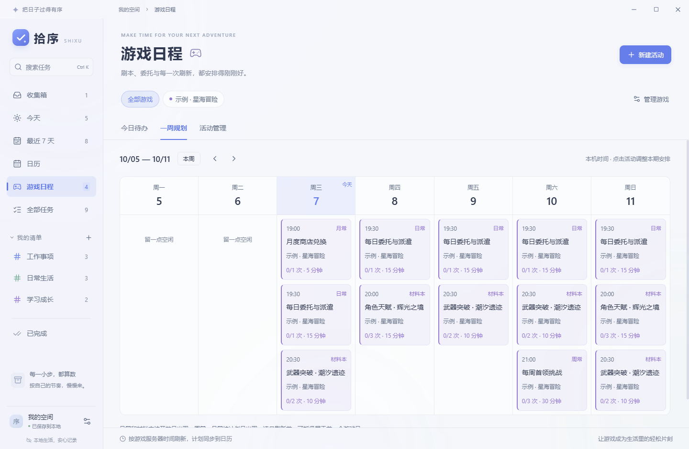

# Dayloom · 拾序

一个可以离线使用的 Windows 桌面任务与日程应用。参考滴答清单的导航结构，采用原生亚克力窗口、半透明面板与克制的蓝色。主文字 14–15px，支持浅色、深色和跟随系统。

## 直接使用

双击 `release/Dayloom-1.1.0-Windows.exe`（或 `启动拾序.cmd`），无需安装 Node.js，无需登录。

也可以打开 `release/win-unpacked/拾序.exe`。首次运行包含可编辑的示例任务；在「设置 → 清除示例」中移除尚未修改的示例。

推荐 Windows 11 22H2 或更新版本，能显示系统亚克力背景。其他 Windows 版本使用柔和背景回退。应用未做代码签名。

## 已实现

- 任务创建、编辑、完成、恢复、删除与撤销删除。
- 收集箱、今天（含逾期）、最近 7 天、全部任务、已完成、自定义清单。
- 清单新建、编辑、换色、删除；删除清单时任务移回收集箱。
- 四档优先级、计划日期、开始时间、时长、备注与子任务。
- 全局搜索名称、备注、子任务与清单；按日期或优先级排序。
- 迷你月历与当天日程；完整周/月日历。
- 点击时间格创建日程，拖动日程改期；重叠事件并排，跨午夜日程在次日接续。
- 应用运行期间的桌面提醒；仅提醒显式打开开关且设置日期和时间的任务。
- 本地持久化、原子写入、自动保留上一份备份、损坏文件恢复。
- JSON 导入与导出；导入校验后确认替换。
- 深浅主题、磨砂浓度、原生窗口拖动/最小化/最大化/关闭。
- 游戏日程：固定星期开放的材料本、日常、周常、月常及每期次数目标。
- 按游戏自定义服务器时区、凌晨刷新时间、周/月刷新日；自动切换新周期。
- 今日活动、一周规划、活动管理；暂停恢复、逐次打卡、预计时长与剩余体力。
- 游戏活动自动出现在原有日历中；每期可单独改期，完成记录独立保存。

桌面提醒需要应用保持运行，最小化也可以；退出后不提醒。当前版本不包含云同步、账号系统、第三方日历订阅。重复活动在「游戏日程」中配置；普通任务仍为单次任务。游戏活动暂不发送桌面通知。

## 规划游戏活动

1. 打开左侧「游戏日程」，添加游戏并确认服务器时区与刷新时间。默认值是 UTC+8、04:00、周一、每月 1 日，可按游戏修改。
2. 新建活动，选择材料本、日常、周常或月常。材料本选择开放星期；周/月常选择计划日，填写每期次数、单次用时和体力。
3. 在「今日待办」逐次加减完成次数，或点击「完成」完成本期目标。点「已完成」可以撤销；下个周期会重新计数。
4. 在「一周规划」或原有日历中点击活动，单独安排本期的日期与时间。日历拖动同样有效，且只能放在该期开放区间内。

刷新前仍按前一游戏日计算，例如 04:00 刷新的游戏在周三 02:00 仍属于周二。规则里的时间使用服务器时区，日历里的时间使用本机时区；29–31 日遇到短月份自动使用月末。服务器时区为固定 UTC 偏移，不自动跟随夏令时。

暂停只隐藏活动；删除游戏会一并删除其活动与完成记录。修改开放规则会开始新的计数，改名和调整目标会保留进度。通用示例是虚构活动，需要按实际游戏修改。



## 快捷键

| 操作 | 快捷键 |
| --- | --- |
| 搜索任务 | Ctrl + K |
| 新建任务 | Ctrl + N |
| 快速输入后创建 | Enter |
| 保存任务编辑 | Ctrl + Enter |
| 关闭弹窗 | Esc |

## 数据位置

在「设置 → 数据目录」中打开实际保存位置。Windows 默认为 `%APPDATA%/拾序/shixu-data.json`；实际路径也显示在设置里。

- `shixu-data.json`：当前数据。
- `shixu-data.json.backup`：上一份有效数据。
- `shixu-data.json.corrupted-*`：恢复时保留的损坏原件。

便携程序只表示免安装启动，数据仍保存在当前 Windows 用户的应用数据目录中。浏览器预览采用 localStorage，与桌面版相互独立，可通过导入/导出迁移。

## 本地开发

需要 Node.js 22.12+（本次使用 Node.js 24）。

```powershell
npm ci
npm run desktop:dev
```

其他命令：

```powershell
npm run dev          # http://127.0.0.1:5173 浏览器预览
npm run build        # TypeScript 检查与前端构建
npm start            # 运行已构建的桌面版
npm test             # 34 项任务与周期逻辑测试
npm run test:desktop # 桌面操作与持久化验收，使用临时数据目录
npm run test:games   # 游戏日程、打卡、改期、重启与跨凌晨刷新验收
npm run package      # Windows x64 便携程序
```

Electron 首次使用会下载运行时。`electronDist` 使用 `node_modules/electron/dist`；新环境应先执行一次 `npm start` 或 `node node_modules/electron/install.js` 完成下载，再进行打包。

应用图标 PNG/ICO 已纳入项目，不需要重新生成。`scripts/create-icon.py` 是可选的图标源脚本，运行需要 Pillow。

## 实现结构

- `docs/01-ui-design.md`：首先完成的界面方案。
- `docs/02-functional-design.md`：随后制定的基础功能与数据契约。
- `docs/04-game-planner-design.md`：游戏日程的界面、刷新规则与数据设计。
- `src/components/`：清单、任务、日历、编辑和设置界面。
- `src/domain.ts`：本地日期、筛选、排序和日历布局规则。
- `src/gaming.ts`：服务器游戏日、周期目标、完成记录与日历投影。
- `src/storage.ts`：桌面 IPC 与浏览器本地存储适配。
- `shared/schema.mjs`：主进程与前端共用的数据校验。
- `electron/`：原生窗口、文件存储、备份对话框和提醒。
- `tests/`：核心规则和真实 Electron 操作回归。

使用 React、TypeScript、Vite、Electron 与 Lucide 图标；无需服务端。主进程关闭 Node 注入，启用上下文隔离和沙箱，IPC 限定调用来源。

## 设计参考

[TickTick Windows](https://www.ticktick.com/windows) 的任务和日程并排布局；[Electron BrowserWindow](https://www.electronjs.org/docs/latest/api/browser-window) 的原生背景材质支持。
