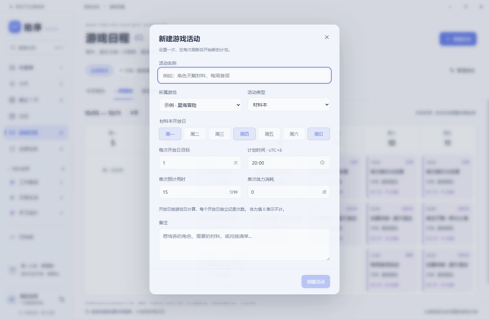

# Dayloom 1.1.0 游戏日程验收

验收日期：2026 年 10 月 7 日。设计见 [游戏日程方案](04-game-planner-design.md)。

## 交付内容

- 左侧新增游戏日程，包含今日待办、一周规划和活动管理。
- 每个游戏独立设置固定 UTC 时区、每日刷新时间、周刷新日、月刷新日。
- 材料本按开放星期出现；日常、周常、月常按各自周期记录目标次数。
- 完成、撤销、逐次增减、暂停恢复、规则编辑和确认删除。
- 计划时间、单次用时、体力消耗和备注；支持单期改期。
- 周/月日历和日程侧栏显示游戏活动，拖动只调整当前周期。
- 保留原有 JSON 数据兼容性；备份包含游戏规则、完成记录和单期计划。
- 提供明确标注的通用示例，不内置任何未经核实的真实游戏规则。

## 验证结果

- TypeScript 严格检查和 Vite 生产构建通过。
- `npm test`：34 项逻辑测试通过，含原有 13 项任务测试和新增 21 项周期测试。
- `npm run test:desktop`：原有 17 项桌面操作回归通过。
- `npm run test:games`：10 项游戏日程操作回归通过。
- 两套桌面回归均在 `release/win-unpacked/拾序.exe` 上复验通过，未发现渲染进程未捕获异常。

周期测试覆盖凌晨刷新瞬间、开放日、周/月边界、闰年、月末、服务器时区、自定义刷新日、每期进度隔离、跨周期改期拦截、未来活动禁止提前打卡、暂停恢复，以及旧数据和损坏数据的导入校验。额外验证了本机 UTC+14、服务器 UTC−12 时，凌晨计划跨越三个日期仍能正确进入本机日历。

桌面测试使用独立临时数据目录，验证了游戏与活动创建、材料本星期选择、月常日期选择、目标次数、剩余体力、日历集成、单期改期、重启恢复，以及应用持续运行经过凌晨刷新后的自动切换。游戏测试固定浏览器时钟，方便复现刷新边界；不会修改系统时钟或用户数据。

## 视觉与使用范围

检查了 1440 × 940 桌面窗口、1000 × 740 窄窗口，以及浏览器窄面板。保留磨砂面板和深浅主题；活动标题使用 16px，操作文字与辅助信息使用 12–14px。较窄窗口的一周规划支持横向滚动。




本版本不读取游戏账号、不自动识别游戏内完成情况。用户手动记录次数；体力字段用于计划估算，不模拟自动恢复。游戏活动暂不发送桌面通知。旧规则的完成记录会保留在本地数据和导出文件中，界面按当前规则展示。

## 复验

```powershell
npm run build
npm test
npm run test:desktop
npm run test:games
npm run package
node tests/desktop-smoke.mjs --packaged
node tests/game-planner-smoke.mjs --packaged
```

运行报告位于 `test-results/`，不纳入 Git。便携程序为 `release/Dayloom-1.1.0-Windows.exe`；沿用既有应用标识和数据目录。
