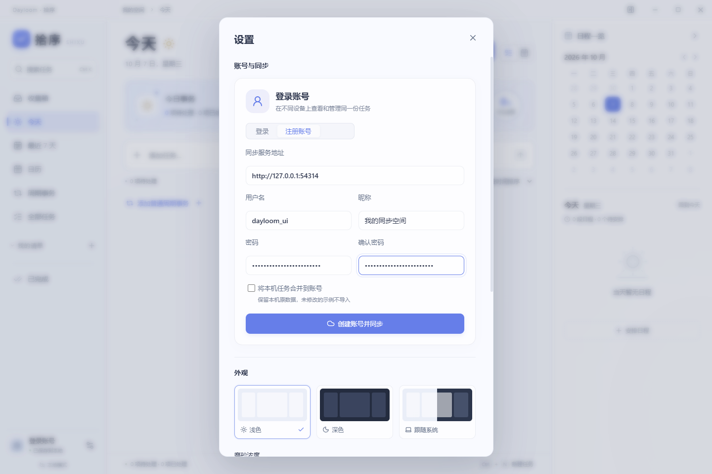
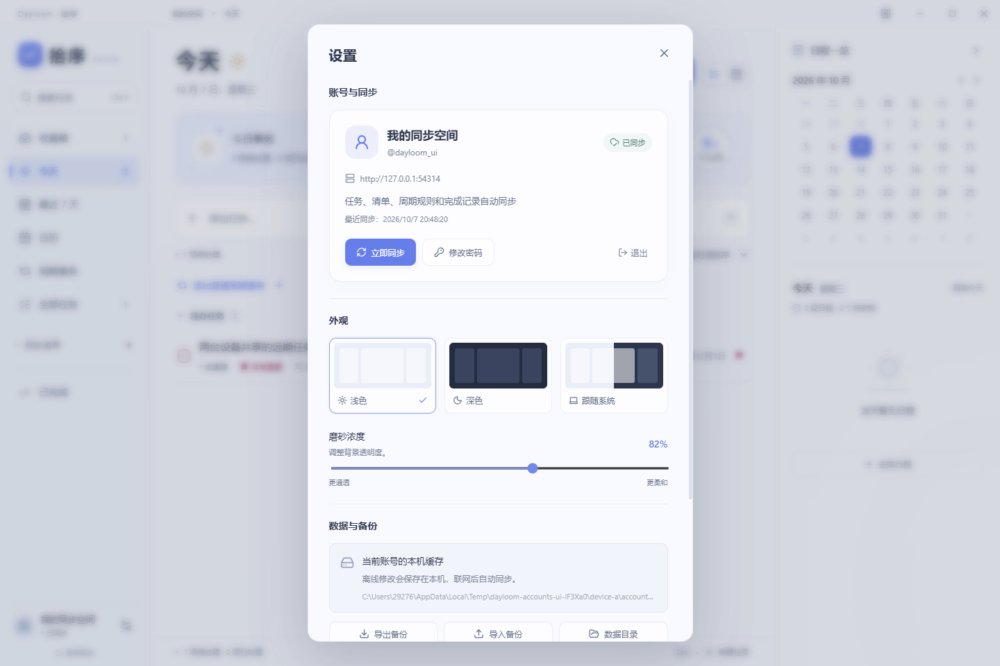

# 1.3.0 验证记录

日期：2026-10-07。环境：Windows 11，Node.js 24.15.0，Electron 44.5.1。

## 验证结果

| 验证 | 结果 |
| --- | --- |
| TypeScript 检查及 Vite 生产构建 | 通过 |
| `npm test` | 54 项通过，包括旧数据迁移、非常重要、三方合并、响应丢失重试、账号隔离、认证与 SQLite 重启 |
| `node tests/desktop-smoke.mjs --packaged` | 17 项通过 |
| `node tests/game-planner-smoke.mjs --packaged` | 10 项通过 |
| `node tests/planning-smoke.mjs --packaged` | 7 项通过 |
| `node tests/accounts-smoke.mjs --packaged` | 6 项通过，两个独立 Electron 进程和独立数据目录 |
| `node tests/accounts-browser-smoke.mjs` | 2 项通过，使用两个隔离的 Edge 浏览器空间和普通 HTTP 主机名 |
| `docker compose config --quiet` | 通过；本机 Docker 引擎未运行，未进行容器构建和启动验收 |

共 96 项自动化断言组通过。账号测试均使用临时服务和测试账号，未修改实际用户数据。打包桌面程序的文件版本为 1.3.0；桌面与开始菜单快捷方式指向新的 `release/win-unpacked/拾序.exe`，保留独立 ICO 和 `app.shixu.desktop` 标识。

## 主要场景

- 远期的非常重要任务在「今天」显示，跨午夜继续显示；勾选完成后次日停止，恢复后重新出现。原专属导航和每日推进操作已移除。
- 两个桌面进程共享同一账号，自动同步新建任务，编辑备注、完成、删除均可传递到另一端。任务编辑面板打开期间收到的远端字段修改也会保留；保存后复查所属清单、优先级和时长。
- 停止服务、离线编辑、在原端口重启服务后，两端继续同步。桌面重启恢复系统加密的会话和账号缓存；页面无法获得会话令牌。
- 修改密码会撤销其他会话；被撤销的设备可以继续编辑缓存，重新登录后上传积累的修改。
- 同字段冲突保留副本；删除不恢复原 ID；不同版本规则的周期打卡不错误相加；已提交但丢失响应的重试不重复计数。
- 退出账号恢复独立的访客空间。普通 HTTP 局域网网页也可创建任务和注册登录，不依赖安全上下文中的 `crypto.randomUUID`。
- 已复核浅色、深色、紧凑窗口与新的账号面板。没有未捕获的页面异常。

## 交付与边界

便携程序：`release/Dayloom-1.3.0-Windows.exe`。旧程序保存在 `release/previous-1.2.1-accounts`，更新前本机 JSON 数据保存在 `release/backup-before-1.3.0`。

提供 Node.js/SQLite 服务、Dockerfile、Compose 和 [自部署说明](10-self-hosting.md)。本机 `127.0.0.1:4318` 健康接口已验证返回 1.3.0，未部署公网。服务需要保持运行；更换设备时连接同一个服务地址。暂不提供邮件找回密码、社交登录、多人协作清单或服务端通知。

